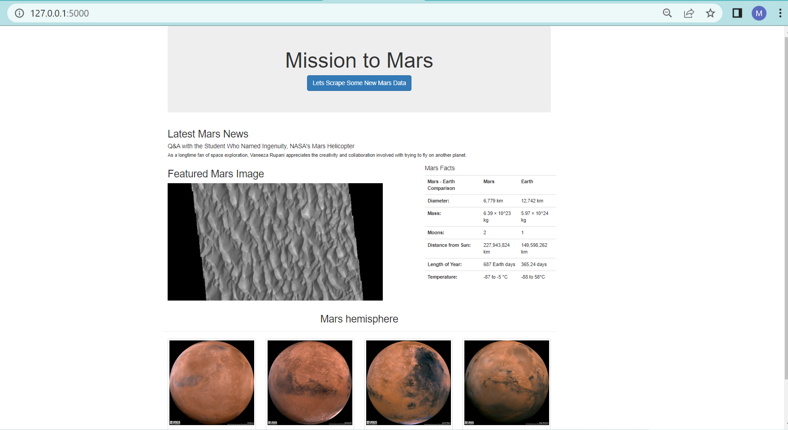

# Web-Scraping-Challenge -Mission To Mars

## Few facts about Mars:
## Did you know?  
   * Mars has two small moons: Phobos and Deimos. Phobos (fear) and Deimos (panic) were named after the horses that pulled the chariot of  the Greek war god Ares, the counterpart to the Roman war god Mars. Both Phobos and Deimos were discovered in 1877 by American astronomer Asaph Hal. 

   * If you weighed 100 lbs on Earth, you would only weigh 38 lbs on Mars.
   * One year of Earth is equal to 365.25 Days, whereas on Mars a year is 687 Earth Days.

## Purpose:

The main goal of this assignment is to build a web application that scrapes various websites for data related to the Mission to Mars and displays the information in a single HTML page. The following information outlines what will need to do.

## Configuration:
The following are the parts this assignment is divided into:

* Scraping
* MongoDB and Flask Application


## Part 1 - Scraping:

We would need to intially scrape using Jupyter Notebook, BeautifulSoup, Pandas and Requests/Splinter.We will create a Jupyter Notebook and call is mission_to_mars.ipynb. We would perform all our scraping and analysis tasks. The following are the thigns that we need to scrape:

### NASA Mars News

* We would need to scrape the [Mars News Site](https://redplanetscience.com/) and collect the latest News Title and Paragraph Text. We woulld need to assign text to variable inorder to reference them alter.

```python
# Example:
news_title = "NASA's Next Mars Mission to Investigate Interior of Red Planet"

news_p = "Preparation of NASA's next spacecraft to Mars, InSight, has ramped up this summer, on course for launch next May from Vandenberg Air Force Base in central California -- the first interplanetary launch in history from America's West Coast."
```

### JPL Mars Space Images—Featured Image

* We would visit the URL for the Featured Space Image site "https://spaceimages-mars.com".

* We would use Splinter to navigate the site and find the image URL for the current Featured Mars Image, then assign the URL string to a variable called `featured_image_url`.

* We need to find the image URL to the full-sized `.jpg` image and save a complete URL string for this image


```python
# Example:
featured_image_url = 'https://spaceimages-mars.com/image/featured/mars2.jpg'
```

### Mars Facts

* We would visit the [Mars Facts webpage](https://galaxyfacts-mars.com) and use Pandas to scrape the table containing facts about the planet including diameter, mass, etc.

* We would use Pandas to convert the data to a HTML table string.

### Mars Hemispheres

* We would visit the [astrogeology site](https://marshemispheres.com/) to obtain high-resolution images for each hemisphere of Mars.

* We will need to click each of the links to the hemispheres in order to find the image URL to the full-resolution image.

* We will save the image URL string for the full resolution hemisphere image and the hemisphere title containing the hemisphere name. Using a Python dictionary, we will store the data using the keys `img_url` and `title`.

* We will append the dictionary with the image URL string and the hemisphere title to a list. This list will contain one dictionary for each hemisphere.

```python
# Example:
hemisphere_image_urls = [
    {"title": "Valles Marineris Hemisphere", "img_url": "..."},
    {"title": "Cerberus Hemisphere", "img_url": "..."},
    {"title": "Schiaparelli Hemisphere", "img_url": "..."},
    {"title": "Syrtis Major Hemisphere", "img_url": "..."},
]
```

## Part 2- MongoDB and Flask Application:

We would use MongoDB with Flask templating to create a new HTML page that displays all the information that was scraped from the URLs above.

* We woulld need to create a python file using the data inside our mission to mars jupyter notebook and call this python script as `scrape_mars.py` by using a function called `scrape_all`. This function should  execute all our scraping code from above and return one Python dictionary containing all the scraped data.

* Next, e will create a route called `/scrape` that will import our `scrape_mars.py` script and call your `scrape_all` function.

  * We will store the return value in Mongo as a Python dictionary.

* We will create a index route `/` that will query our Mongo database and pass the Mars data into an HTML template for displaying the data.

* We would create a template HTML file called `index.html` that will take the Mars data dictionary and display all the data in the appropriate HTML elements. 

## Conclusion:

After taking all the steps above, I was able to create a page with all the information taken above and that would scrape all the data from the above websites with a press of a button. 




